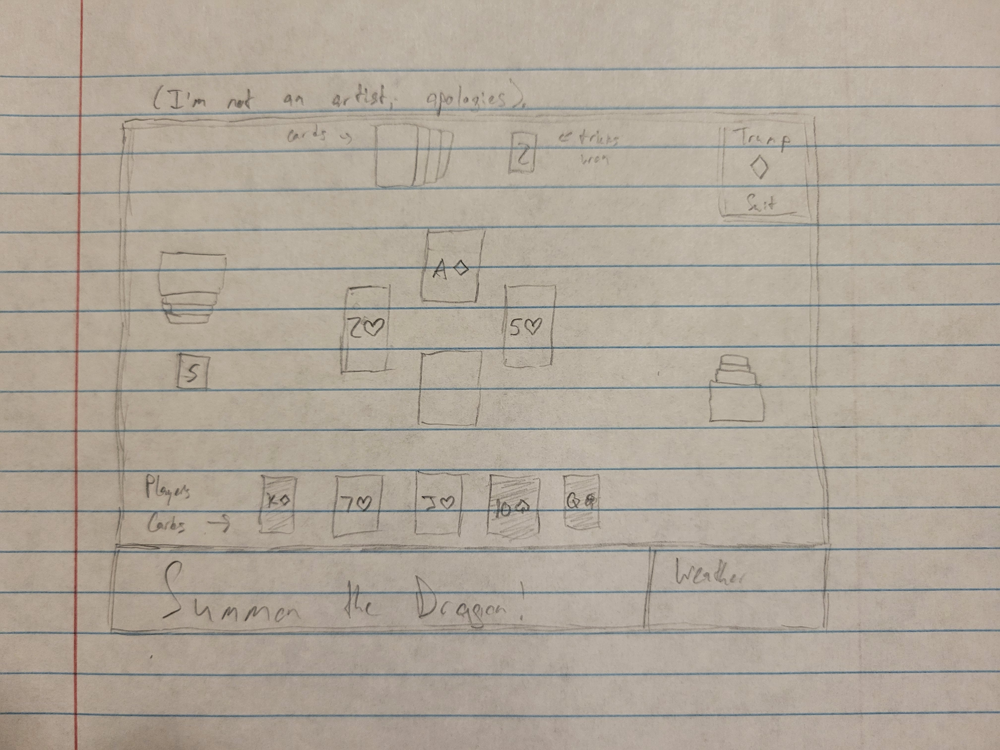
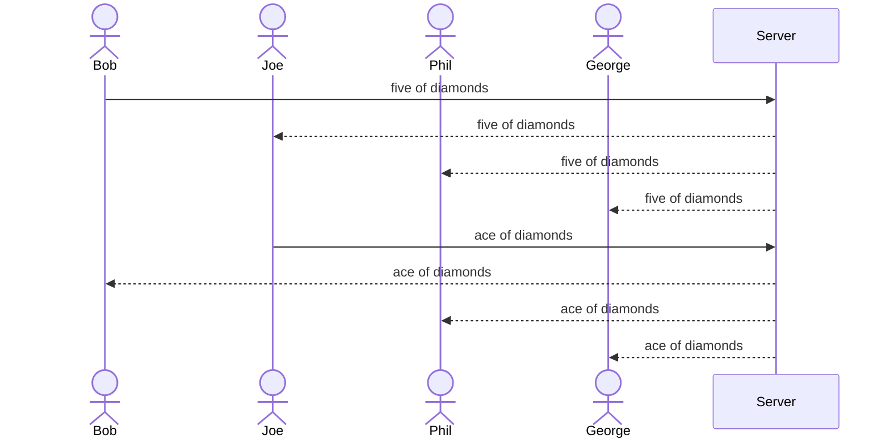

# Summon the Dragon

[My Notes](notes.md)

I'm going to create a web app capable of hosting and playing games of "Summon the Dragon", a trick-taking card game similar to Hearts created by my high school statistics teacher. It'll allow users to register and sign in, create and join lobbies, and play the game. The app will also keep track of user statistics (how often the players wins vs loses, average points per game, etc).

> [!NOTE]
> This is a template for your startup application. You must modify this `README.md` file for each phase of your development. You only need to fill in the section for each deliverable when that deliverable is submitted in Canvas. Without completing the section for a deliverable, the TA will not know what to look for when grading your submission. Feel free to add additional information to each deliverable description, but make sure you at least have the list of rubric items and a description of what you did for each item.

> [!NOTE]
> If you are not familiar with Markdown then you should review the [documentation](https://docs.github.com/en/get-started/writing-on-github/getting-started-with-writing-and-formatting-on-github/basic-writing-and-formatting-syntax) before continuing.

### Elevator pitch

Want to learn a fun new card game? Enjoy trick-taking games, but hate keeping track of all the rules? The Summon the Dragon application is a perfect match for you! Learn an engaging new take on trick-taking card games with unique mechanics and strategies, while the application does all the work for you! Enjoy the ability to focus on the game as the computer keeps track of whose turn it is, which cards you can play, and the score.

### Design

Here's a sequence diagram showing how the game is updated after a player takes their turn

### Key features

- Secure login through HTTPS
- Ability to create and join lobbies
- Shuffling and dealing cards
- Bidding to start the round
- Tracking and displaying the trump suit for the given game after bidding
- Keeping track of who starts each trick (winner of the bid for the first trick, winner of previous trick for each subsequent trick)
- Showing and enforcing which cards are valid to play (must be the leading suit (if the player has it), the trump suit (if the player doesn't and has cards in the trump suit), or any card (if the player has neither))
- Calculating which card wins the trick
- Keeping score (how many tricks each team has won), and calculating points won at the end of the round
- Ability to see cards from the previous trick
- Login info, game data, and user statistics persistently stored in a database

### Technologies

I am going to use the required technologies in the following ways.

- **HTML** - 3 HTML pages (login, joining a lobby, and gameplay), general structure (such as the current trick being displayed in the center, players on the sides, room for the player's hand, trump suit displayed in a corner, etc)
- **CSS** - ability of the application to resize to different screen sizes, animations of playing a card, the cards themselves, etc
- **React** - ability to check the cards of the last trick, displaying the lobby after login and gameplay after joining a lobby, backend endpoint calls (like login and updating the game state), the ability to switch out cards with the kitty if you win the bid, etc
- **Service** - endpoints for registering, login, logout, joining a lobby, leaving a lobby, playing a card, etc. For third party, I'll display the weather from Weatherstack
- **DB/Login** - persistently store user data and game data in the database, can't join a lobby unless authenticated
- **WebSocket** - updating the game state for each user after game events, such as broadcasting the card played to each other player after a player takes their turn, or updating the score for each player after a trick is finished, possibly notifications to each player currently in the lobby when a new player joins the lobby, etc

## 🚀 Specification Deliverable

> [!NOTE]
> Fill in this sections as the submission artifact for this deliverable. You can refer to this [example](https://github.com/webprogramming260/startup-example/blob/main/README.md) for inspiration.

For this deliverable I did the following. I checked the box `[x]` and added a description for things I completed.

- [x] I completed the prerequisites for this deliverable (Git commit requirement) [I only have 8 but assume that's enough given that this is markdown and not code]
- [x] Proper use of Markdown
- [x] A concise and compelling elevator pitch
- [x] Description of key features
- [x] Description of how you will use each technology
- [x] One or more rough sketches of your application. Images must be embedded in this file using Markdown image references.

## 🚀 AWS deliverable

For this deliverable I did the following. I checked the box `[x]` and added a description for things I completed.

- [x] **Rented EC2 server** - I rented a EC2 Nano.
- [x] **Leased domain name** - I leased briancate.click
- [x] **Server accessible** from my domain: [https://briancate.click](https://briancate.click)

## 🚀 HTML deliverable

For this deliverable I did the following. I checked the box `[x]` and added a description for things I completed.

- [x] I completed the prerequisites for this deliverable (Simon deployed, GitHub link, Git commits)
- [x] **HTML pages** - I created 5 HTML pages (index.html for logging in, lobby.html to join a game, play.html to play, scores.html to see user statistics, and about.html)
- [x] **Proper HTML element usage** - I used Head, Body, Nav, Header, Main, and Footer tags for each as requested.
- [x] **Links** - Each page contains links to each other page
- [x] **Text** - Where applicable, added intructive text to clarify how to proceed towards playing a game
- [x] **3rd party API placeholder** - I added a placeholder for a 3rd party call to a weather service
- [x] **Images** - I added an image
- [x] **Login placeholder** - I added a placeholder for login in index.html
- [x] **DB data placeholder** - I added a placeholder for db access in scores.html.
- [x] **WebSocket placeholder** - Many elements of play.html will depend on websocket updates, I noted several examples in HTML comments.

## 🚀 CSS deliverable

For this deliverable I did the following. I checked the box `[x]` and added a description for things I completed.

- [x] I completed the prerequisites for this deliverable (Simon deployed, GitHub link, Git commits)
- [x] **Visually appealing colors and layout. No overflowing elements.** I added a background image and tried to make things look decent
- [x] **Use of a CSS framework** - I used Bootstrap, definitely regret doing so
- [x] **All visual elements styled using CSS** - I did it, what more can I say
- [x] **Responsive to window resizing using flexbox and/or grid display** - This was painful and took years off my life, but it's done
- [x] **Use of a imported font** - This was surprisingly easy, relative to everything else
- [x] **Use of different types of selectors including element, class, ID, and pseudo selectors** - I used at least one of each, but mostly element and class selectors

## 🚀 React part 1: Routing deliverable

For this deliverable I did the following. I checked the box `[x]` and added a description for things I completed.

- [x] I completed the prerequisites for this deliverable (Simon deployed, GitHub link, Git commits)
- [x] **Bundled using Vite** - I did this, idk what else to say
- [x] **Components** - my old HTML files are gone and new React components have taken their places
- [x] **Router** - I set up a functional router

## 🚀 React part 2: Reactivity deliverable

For this deliverable I did the following. I checked the box `[x]` and added a description for things I completed.

- [x] I completed the prerequisites for this deliverable (Simon deployed, GitHub link, Git commits)
- [x] **All functionality implemented or mocked out** - Many of the rules aren't perfectly obeyed, but figure it was good enough for now
- [x] **Hooks** - I used a number of useEffect hooks.

## 🚀 Service deliverable

For this deliverable I did the following. I checked the box `[x]` and added a description for things I completed.

- [ ] I completed the prerequisites for this deliverable (Simon deployed, GitHub link, Git commits)
- [ ] **Node.js/Express HTTP service** - I did not complete this part of the deliverable.
- [ ] **Static middleware for frontend** - I did not complete this part of the deliverable.
- [ ] **Calls to third party endpoints** - I did not complete this part of the deliverable.
- [ ] **Backend service endpoints** - I did not complete this part of the deliverable.
- [ ] **Frontend calls service endpoints** - I did not complete this part of the deliverable.
- [ ] **Supports registration, login, logout, and restricted endpoint** - I did not complete this part of the deliverable.
- [ ] **Uses BCrypt to hash passwords** - I did not complete this part of the deliverable.

## 🚀 DB deliverable

For this deliverable I did the following. I checked the box `[x]` and added a description for things I completed.

- [ ] I completed the prerequisites for this deliverable (Simon deployed, GitHub link, Git commits)
- [ ] **Stores data in MongoDB** - I did not complete this part of the deliverable.
- [ ] **Stores credentials in MongoDB** - I did not complete this part of the deliverable.

## 🚀 WebSocket deliverable

For this deliverable I did the following. I checked the box `[x]` and added a description for things I completed.

- [ ] I completed the prerequisites for this deliverable (Simon deployed, GitHub link, Git commits)
- [ ] **Backend listens for WebSocket connection** - I did not complete this part of the deliverable.
- [ ] **Frontend makes WebSocket connection** - I did not complete this part of the deliverable.
- [ ] **Data sent over WebSocket connection** - I did not complete this part of the deliverable.
- [ ] **WebSocket data displayed** - I did not complete this part of the deliverable.
- [ ] **Application is fully functional** - I did not complete this part of the deliverable.
